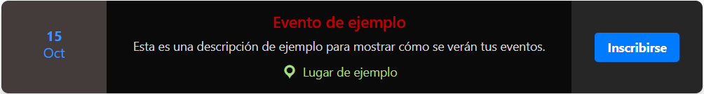
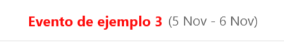
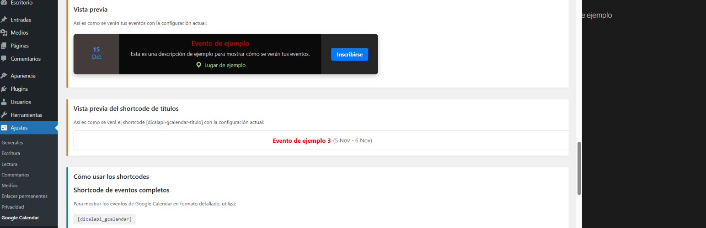

<p align="center">
  
</p>

<h1 align="center">DICALAPI Google Calendar Events</h1>

<p align="center">
  <a href="https://wordpress.org/plugins/">
    
  </a>
  <a href="https://www.php.net/releases/7_0_0.php">
    
  </a>
  <a href="https://github.com/digiraldo">
    
  </a>
</p>

<p align="center">
  Plugin de WordPress para mostrar eventos de Google Calendar en tu sitio web de forma atractiva y personalizable.
</p>

---

## 📋 Descripción

DICALAPI Google Calendar Events es un plugin que permite mostrar eventos de Google Calendar en tu sitio de WordPress con diseño moderno y personalizable. Ofrece dos formatos de visualización:

### ✨ Visualización Completa `[dicalapi_gcalendar]`

<p align="center">
  
</p>

Muestra eventos en un formato de tres columnas con:
- 📅 **Fechas** del evento en la primera columna
- 📝 **Contenido** (título, descripción y ubicación) en la columna central
- 🔗 **Botón de inscripción** en la tercera columna (opcional)

### 🔄 Visualización de Títulos `[dicalapi-gcalendar-titulo]`

<p align="center">
  
</p>

Muestra títulos y fechas de eventos en formato compacto con rotación automática.

---

## 🚀 Características Principales

- 🔄 **Sincronización automática** con Google Calendar
- 🎨 **Diseño totalmente personalizable** desde el panel de administración
- 📱 **Responsive** - Se adapta perfectamente a cualquier dispositivo
- 🔄 **Ticker de títulos** con rotación automática configurable
- 🔗 **Botones de inscripción** personalizables por evento
- ⚡ **Sistema de caché** para mejor rendimiento
- 🌐 **Soporte para traducciones** (multiidioma)

---

## 🔧 Requisitos

- WordPress 5.0 o superior
- PHP 7.0 o superior
- Una cuenta de Google con acceso a Google Calendar
- Una API Key de Google Cloud Platform
- ID del calendario de Google Calendar

---

## 📥 Instalación

1. Descarga el archivo ZIP del plugin
2. Accede al panel de administración de WordPress
3. Ve a **Plugins > Añadir nuevo > Subir plugin**
4. Selecciona el archivo ZIP descargado y haz clic en "Instalar ahora"
5. Una vez instalado, activa el plugin

---

## ⚙️ Configuración

### 🔑 Configuración de la API de Google Calendar

<details>
  <summary><b>👉 Ver instrucciones detalladas</b></summary>

#### 1. Crear un proyecto en Google Cloud Platform

1. Ve a [Google Cloud Platform Console](https://console.cloud.google.com/)
2. Crea un nuevo proyecto o selecciona uno existente
3. Ve al "Dashboard" y haz clic en "Activar APIs y servicios"
4. Busca "Google Calendar API" y habilítala

#### 2. Crear una API Key

1. En el menú lateral, selecciona "Credenciales"
2. Haz clic en "Crear credenciales" y selecciona "Clave de API"
3. Se generará una nueva API Key
4. Recomendado (opcional): Restringe la API Key para mayor seguridad:
   - Haz clic en "Restringir clave"
   - En "Restricciones de aplicación", selecciona "Sitios web HTTP referentes"
   - Añade la URL de tu sitio (ej: `*.tudominio.com/*`)

#### 3. Obtener el ID del Calendario

1. Ve a [Google Calendar](https://calendar.google.com)
2. En la columna izquierda, busca tu calendario
3. Haz clic en los tres puntos junto al nombre del calendario y selecciona "Configuración y compartir"
4. Desplázate hacia abajo hasta "Integrar calendario"
5. Copia el ID del calendario (tiene un formato similar a: `abcdefg12345@group.calendar.google.com`)

**⚠️ Nota importante**: Asegúrate de que tu calendario sea público o esté compartido. Para hacer público tu calendario:
1. En "Configuración y compartir"
2. Ve a "Permisos de acceso"
3. Marca la casilla "Hacer público este calendario"
4. Selecciona "Ver todos los detalles del evento"
</details>

### 🖌️ Configuración en WordPress

1. Una vez activado el plugin, ve a **Ajustes > Google Calendar**
2. Introduce tu API Key de Google Cloud Platform
3. Introduce el ID del Calendario
4. Personaliza la apariencia según tus preferencias
5. ¡Guarda los cambios y comienza a mostrar tus eventos!

<p align="center">
  
</p>

---

## 📝 Uso de Shortcodes

### 📆 Shortcode Principal
```
[dicalapi_gcalendar]
```

Con número específico de eventos:
```
[dicalapi_gcalendar max_events="5"]
```

### 🔄 Shortcode de Títulos
```
[dicalapi-gcalendar-titulo]
```

Con número específico de eventos:
```
[dicalapi-gcalendar-titulo max_events="3"]
```

### 📌 Ubicación de los Shortcodes
Puedes añadir estos shortcodes en:
- Entradas de blog
- Páginas
- Widgets de texto
- Bloques Shortcode en el editor Gutenberg
- Templates de temas mediante la función `do_shortcode()`

### 💡 Ejemplos de Uso

**Ejemplo 1**: Mostrar próximos 3 eventos en página de inicio
```
<h2>Próximos eventos</h2>
[dicalapi_gcalendar max_events="3"]
```

**Ejemplo 2**: Mostrar títulos rotativos en la barra lateral
```
<div class="eventos-destacados">
<h3>Eventos destacados</h3>
[dicalapi-gcalendar-titulo max_events="5"]
</div>
```

**Ejemplo 3**: Combinar ambos shortcodes
```
<section class="seccion-eventos">
  <div class="banner-eventos">
    [dicalapi-gcalendar-titulo]
  </div>
  
  <div class="calendario-completo">
    <h2>Calendario completo</h2>
    [dicalapi_gcalendar]
  </div>
</section>
```

---

## 🔗 URLs de Inscripción Personalizadas

Puedes establecer una URL de inscripción específica para cada evento añadiendo este código en la descripción del evento en Google Calendar:

```
[signup_url:https://tuformulario.com/inscripcion]
```

Esto sobrescribirá la URL predeterminada configurada en el panel de administración, solo para ese evento específico.

## 🏷️ Texto Personalizado para Botones

Puedes personalizar el texto del botón de inscripción para cada evento específico añadiendo este código en la descripción del evento en Google Calendar:

```
[name_btn:Regístrate ahora]
```

Esto sobrescribirá el texto predeterminado del botón configurado en el panel de administración, solo para ese evento específico.

### 🎯 Ejemplo Completo

Puedes combinar ambas funcionalidades en la descripción de un evento:

```
Descripción del evento aquí. Este evento será genial y aprenderás mucho.

[signup_url:https://formulario.com/evento-especial] 
[name_btn:¡Apúntate ya!]
```

> **💡 Nota importante:** Los códigos especiales `[signup_url:...]` y `[name_btn:...]` se eliminarán automáticamente de la descripción mostrada al público, manteniendo solo el texto descriptivo limpio.

---

## 🛠️ Solución de Problemas Comunes

### ❌ No se muestran eventos
- Verifica que la API Key y el Calendar ID sean correctos
- Asegúrate de que el calendario sea público o esté compartido correctamente
- Comprueba que la API de Google Calendar esté habilitada en Google Cloud Platform
- Revisa la consola del navegador para ver posibles errores de JavaScript

### 🔒 Error de autenticación
- Verifica que la API Key no tenga restricciones que bloqueen tu dominio
- Asegúrate de que la API esté habilitada en Google Cloud Platform
- Intenta generar una nueva API Key si los problemas persisten

### 🔄 Eventos no actualizados
- Los eventos se almacenan en caché temporalmente para mejorar el rendimiento
- Espera unos minutos o utiliza la opción "Limpiar caché" en la configuración del plugin
- Si actualizas un evento en Google Calendar, puede tardar hasta 30 minutos en reflejarse

### 🎨 Problemas de estilos
- Si los estilos no se aplican correctamente, puede haber conflictos con tu tema
- Intenta aumentar la especificidad de los selectores CSS en la configuración
- Usa la opción "!important" en los estilos personalizados si es necesario

---

## 📜 Licencia

Este plugin está licenciado bajo GPL2. Puedes consultar los detalles completos en [GNU General Public License v2.0](https://www.gnu.org/licenses/gpl-2.0.html).

---

## 👨‍💻 Autor

DiGiraldo
- [Perfil en WordPress](https://profiles.wordpress.org/digiraldo/)
- [GitHub](https://github.com/digiraldo)

---

## 💬 Soporte

Para soporte técnico o consultas, puedes:
- Contactar al autor a través de su perfil en WordPress
- Abrir un issue en el repositorio de GitHub del plugin
- Consultar la documentación en línea disponible en la página del plugin

---

## ❤️ Donaciones
## ☕ ¿Te ha sido útil este plugin?

Si este plugin te ha sido útil y quieres apoyar su desarrollo, considera hacer una donación:

<p align="center">
  <a href="https://www.paypal.com/paypalme/disaned">
    
  </a>
  &nbsp;&nbsp;
  <a href="https://buymeacoffee.com/digiraldo">
    
  </a>
  &nbsp;&nbsp;
  <a href="https://ko-fi.com/digiraldo">
    
  </a>
</p>

---

<p align="center">
  <a href="https://github.com/digiraldo/dicalapi-google-calendar">
    
  </a>
</p>
